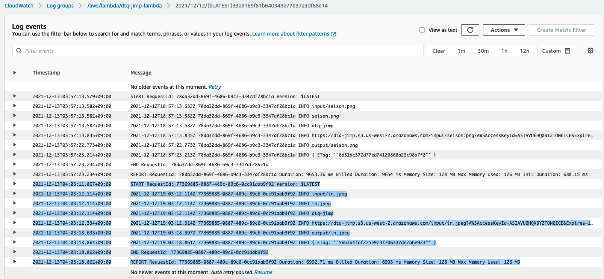
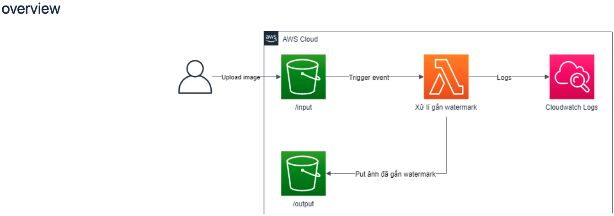
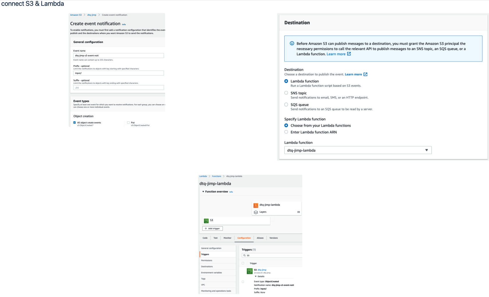

# nodejs-s3-jimp-watermark 🐳

## reference
[vtiblog](https://vtitech.vn/serverless-don-gian-gan-watermark-tu-dong-voi-lambda-s3-va-jimp-plugin/)

## screenshots
+ upload file in "input" folder on S3

+ output file in "ouput" folder on S3

+ log in CloudWatch

+ overview

+ connect S3 & Lambda

