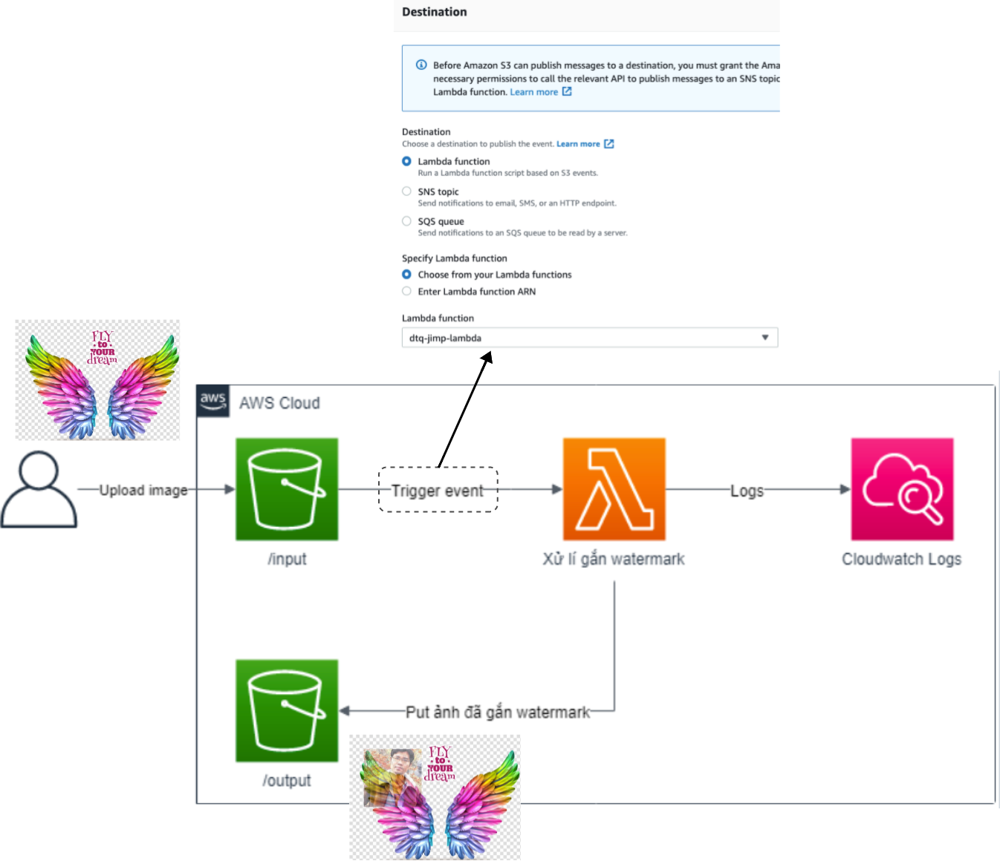

# aws-lambda-nodejs-s3-jimp-watermark 🐳

## reference
[vtiblog](https://vtitech.vn/serverless-don-gian-gan-watermark-tu-dong-voi-lambda-s3-va-jimp-plugin/)

## screenshots
+ upload file in "input" folder on S3
---

+ output file in "ouput" folder on S3
---

+ log in CloudWatch

+ connect S3 & Lambda

+ Quay trở lại AWS, mở Lambda function và add giá trị cho biến BUCKET_NAME vào enviroment variables: key=`BUCKET_NAME` & value=`dtq-jimp`
